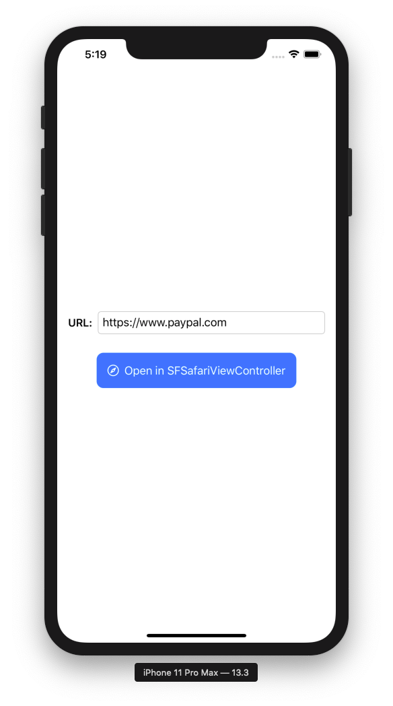

# To run:

1. Open this project in xcode
1. Run the project (hit cmd + R)
1. It should open the app in the iOS simulator, where you can provide the URL and open it in a SFVC
1. Once you launched the SFVC, you can debug it in Safari once you have the developer tools enabled

